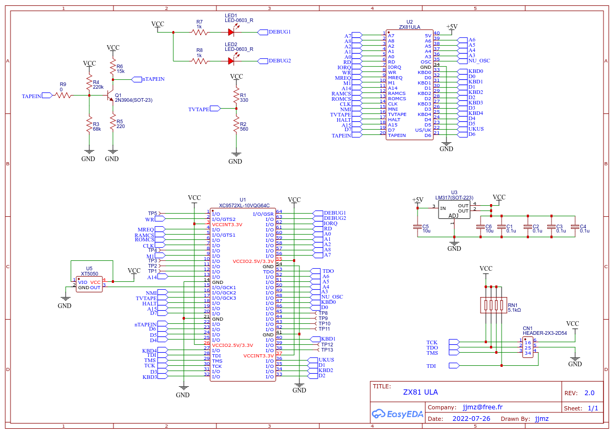

# zx81ula-vhdl

my ZX81 ULA replacement - vhdl for xc9500xl (9572xl-64)

- Project Navigator Output (v14.7 - lin64 image running with VirtualBox)

- Prototype Photos

- Schematic (badly named schematic_xc9536... but really needs a xc9572)

- xc3sprog tp program the CPLD
  - https://anastas.io/hardware/2020/09/29/xc9500-cpld-raspberry-pi-xc3sprog.html
  - See also the 'remoteprog' script
